# Lab3web

Langkah-langkah Praktikum
Persiapan membuat dokumen HTML dengan nama file lab3_list.html seperti berikut.

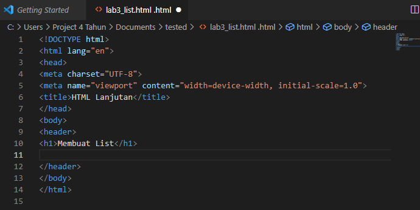

Maka hasilnya akan seperti ini

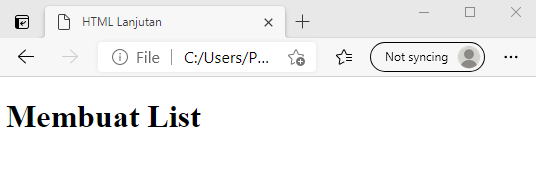

Membuat Ordered List
Kemudian tambahkan kode untuk membuat Ordered List seperti berikut.
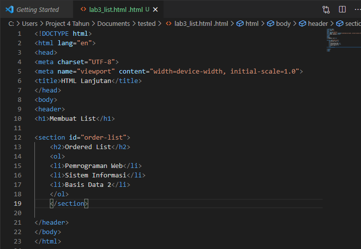

Maka hasilnya akan seperti ini

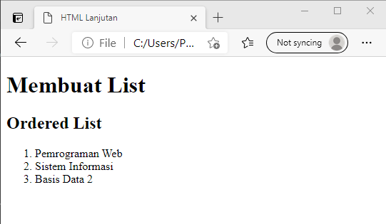

Membuat Unorderd List
Kemudian tambakan kode  untuk  membuat  Unordered List,  setelah  deklarasi ordered list  pada section unordered-list, seperti berikut.
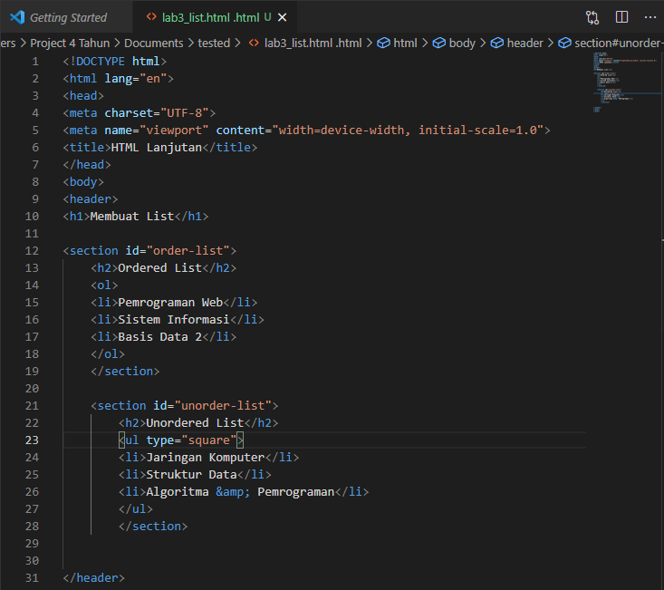

Maka hasilnya seperti ini 

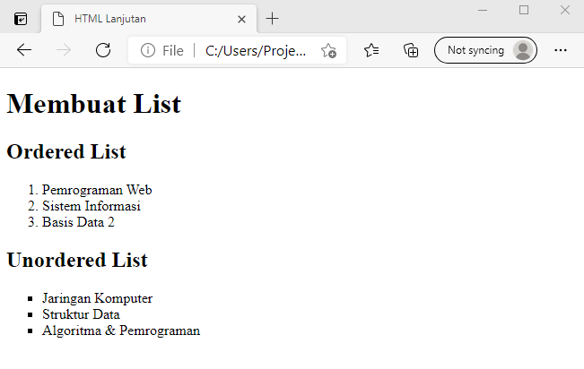

Membuat Description List
Kemudian tambahkan kode untuk membuat description list setelah deklarasi unorderd-list.
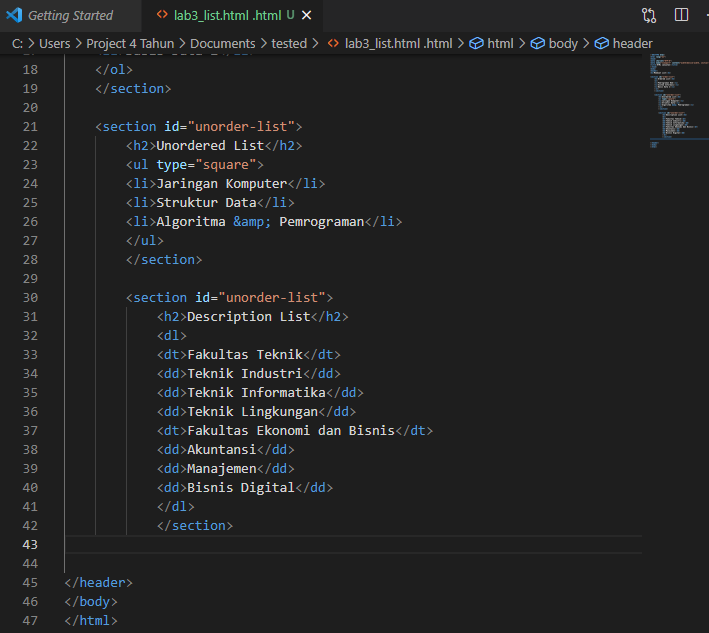

Maka hasilnya seperti ini 

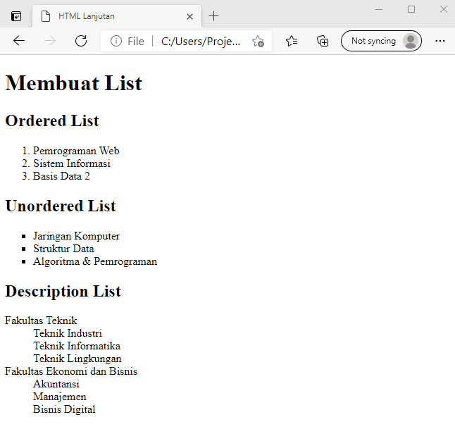

Membuat Tabel
Buat file baru dengan nama lab3_tabel.html seperti berikut.
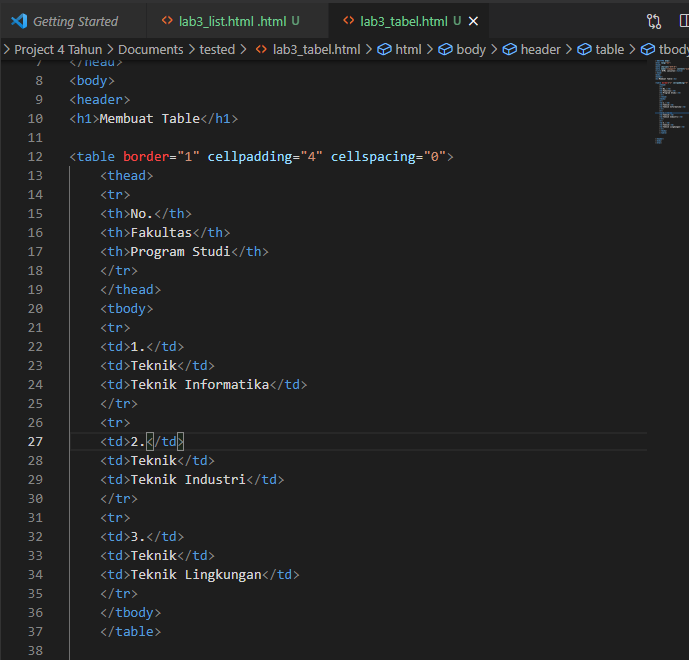

Maka hasilnya seperti ini 

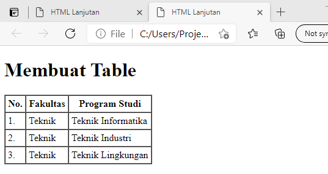

Menggabungkan Sel Data
Untuk menggabungkan sel data, gunakan atribut rowspan dan colspan. Atribut rowspan untuk menggabungkan baris (secara vertikal) dan colspan untuk menggabungkan kolom (secara horizontal).
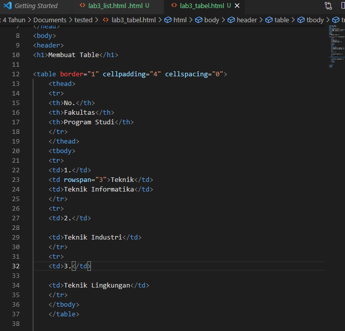

Maka hasilnya seperti ini 

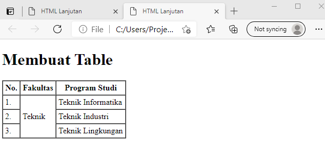

Membuat Form
Buat file baru dengan nama lab3_form.html seperti berikut.
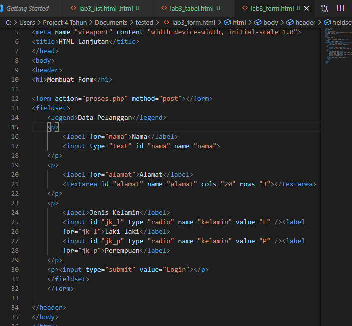

Maka hasilnya seperti ini 

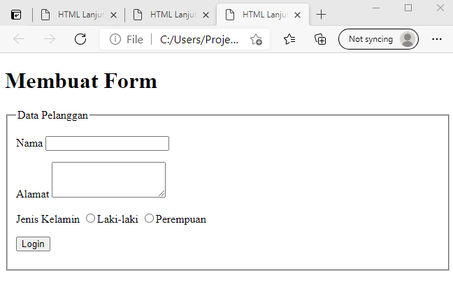