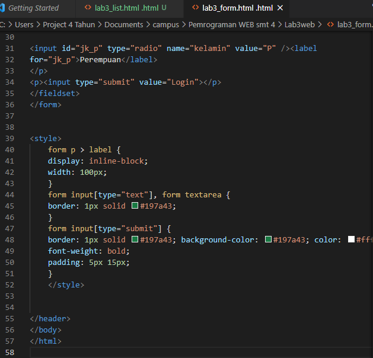
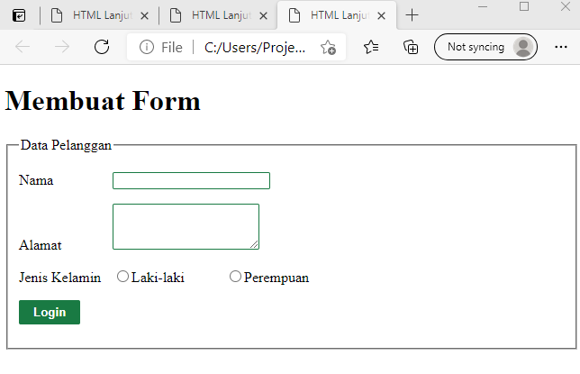
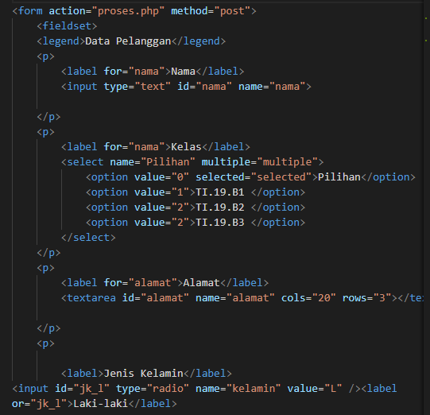
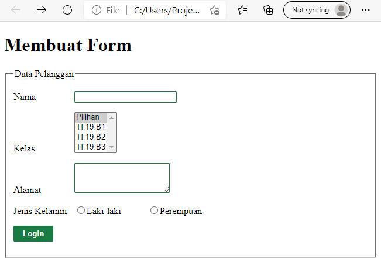
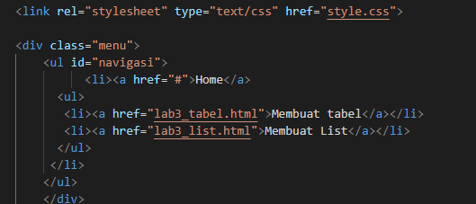
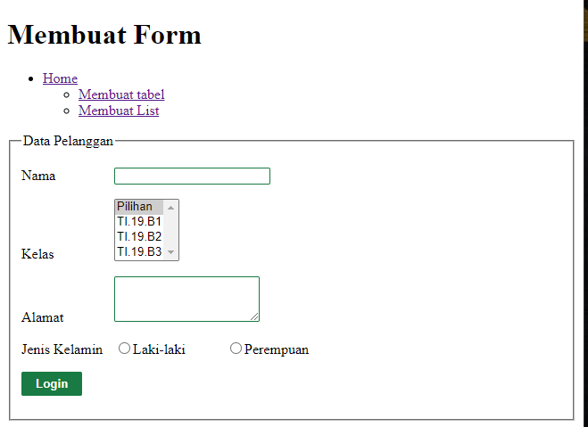
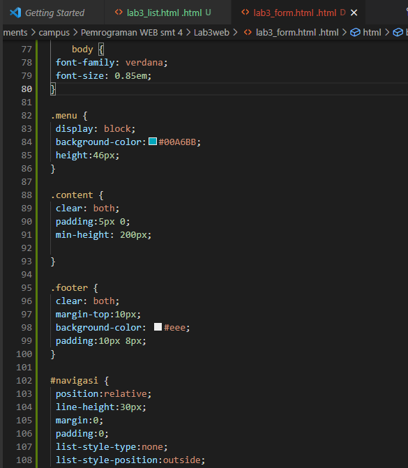
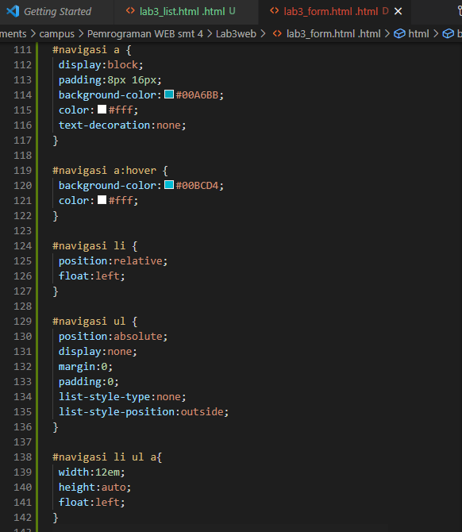
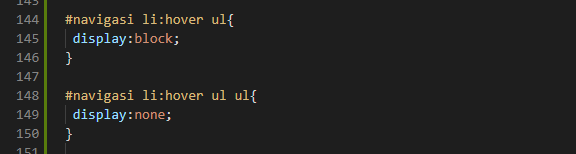
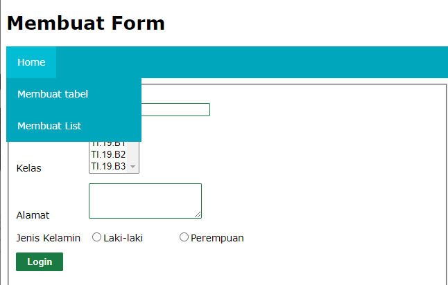

# Lab3web

Langkah-langkah Praktikum
Persiapan membuat dokumen HTML dengan nama file lab3_list.html seperti berikut.

Maka hasilnya akan seperti ini

Membuat Ordered List
Kemudian tambahkan kode untuk membuat Ordered List seperti berikut.

Maka hasilnya akan seperti ini

Membuat Unorderd List
Kemudian tambakan kode  untuk  membuat  Unordered List,  setelah  deklarasi ordered list  pada section unordered-list, seperti berikut.

Maka hasilnya seperti ini 

Membuat Description List
Kemudian tambahkan kode untuk membuat description list setelah deklarasi unorderd-list.

Maka hasilnya seperti ini 

Membuat Tabel
Buat file baru dengan nama lab3_tabel.html seperti berikut.

Maka hasilnya seperti ini 

Menggabungkan Sel Data
Untuk menggabungkan sel data, gunakan atribut rowspan dan colspan. Atribut rowspan untuk menggabungkan baris (secara vertikal) dan colspan untuk menggabungkan kolom (secara horizontal).

Maka hasilnya seperti ini 

Membuat Form
Buat file baru dengan nama lab3_form.html seperti berikut.

Maka hasilnya seperti ini 

Menabahkan Style pada Form
Agar tampilan form lebih menarik, bisa ditambahkan CSS seperti berikut.

Maka hasilnya seperti ini 

Berikut form yang menampilkan dropdown menu dan listbox dengan multiple selection.
Masukkan code seperti dibawah ini pada body :

Maka hasilnya seperti ini 

Lalu masukkan code dibawah ini untuk isi dropdown :
Masukkan code seperti dibawah ini pada body :

Maka hasilnya seperti ini 

Lalu tambahkan CSS untuk dropdownnya :

Maka hasilnya seperti ini 
